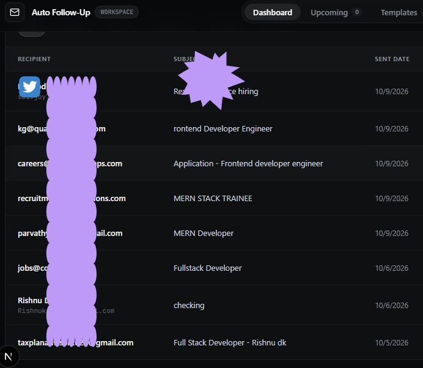

# 📬 Auto Email Follow-Up System

An intelligent, full-stack email follow-up automation platform that seamlessly integrates with Gmail. It monitors your sent emails, schedules multi-step follow-ups using Redis and BullMQ, intelligently detects replies, bounces, and out-of-office auto-responders to prevent redundant emails, and provides a sleek modern dashboard to manage everything.



---

## ✨ Features

- **🔄 Automated Gmail Sent-Email Sync**: Continuously polls sent messages with automatic thread deduplication and RFC 2822 header extraction (`Message-ID`, `In-Reply-To`, `References`).
- **⚡ Resilient BullMQ Job Scheduling**: Deterministic delayed queues (`followup:<threadId>:<attempt>`) with customizable delays and intelligent business-hours/weekday scheduling.
- **🛡️ Smart Reply & Bounce Detection**:
  - Live Gmail thread inspection prior to dispatch.
  - Distinguishes real human replies from out-of-office auto-replies (`Auto-Submitted: auto-replied`, `X-Autoreply: yes`).
  - Detects mail delivery failures (`mailer-daemon`, `postmaster`) and automatically halts scheduled follow-ups.
- **📝 Dynamic Template Engine**: Rich template variables like `{{recipientName}}`, `{{senderName}}`, `{{originalSubject}}`, `{{company}}`, and `{{position}}`.
- **🔐 Bank-Grade Token Security**: AES-256 encryption at rest for stored Google OAuth refresh tokens with automatic token rotation.
- **🛡️ Safety & "Draft First" Mode**: Safe staging option to generate Gmail drafts for inspection before live-sending emails.


---


## 📋 Prerequisites

Before running the application, make sure you have:

1. **Node.js** (v20.x or higher) & **npm** (v10.x or higher)
2. **Docker Desktop** (for running PostgreSQL and Redis)
3. **Google Cloud Project** with:
   - Gmail API enabled
   - OAuth 2.0 Credentials (Client ID & Client Secret)
   - Authorized redirect URI: `http://localhost:4000/auth/google/callback`

---

## ⚙️ Environment Variables

Create a `.env` file in the root directory (you can copy [.env.example](file:///.env.example)):

```bash
cp .env.example .env
```
---

## 🚀 Quick Start Guide

### 1. Install Dependencies
Run from the root directory:
```bash
npm install
```

### 2. Start PostgreSQL & Redis
Spin up the database and Redis cache with Docker:
```bash
npm run docker:up
# Or: docker compose up -d
```

### 3. Generate Prisma Client & Run Migrations
Initialize the PostgreSQL schema and Prisma client:
```bash
npm run db:generate
npm run db:migrate
```

*(Optional: Run `npm run --workspace=@email-followup/api db:seed` to seed sample follow-up templates)*

### 4. Build the Shared Workspace Package
Compile `@email-followup/shared` so the API and Web apps can import the shared types:
```bash
npm run build --workspace=@email-followup/shared
```

### 5. Start the Development Servers

For the best developer experience with clean logs and independent restarts, run the backend and frontend in **two separate terminal windows**:

#### Terminal 1 — Backend API & Queue Worker:
```bash
npm run dev:api
```
> Starts Fastify on **`http://localhost:4000`**, boots the BullMQ worker, and starts the 5-minute Gmail sync interval.

#### Terminal 2 — Frontend Web Dashboard:
```bash
npm run dev:web
```
> Starts Next.js on **`http://localhost:3000`**.

---

*(Alternative)* **Run everything concurrently in a single terminal:**
```bash
npm run dev
```

---

